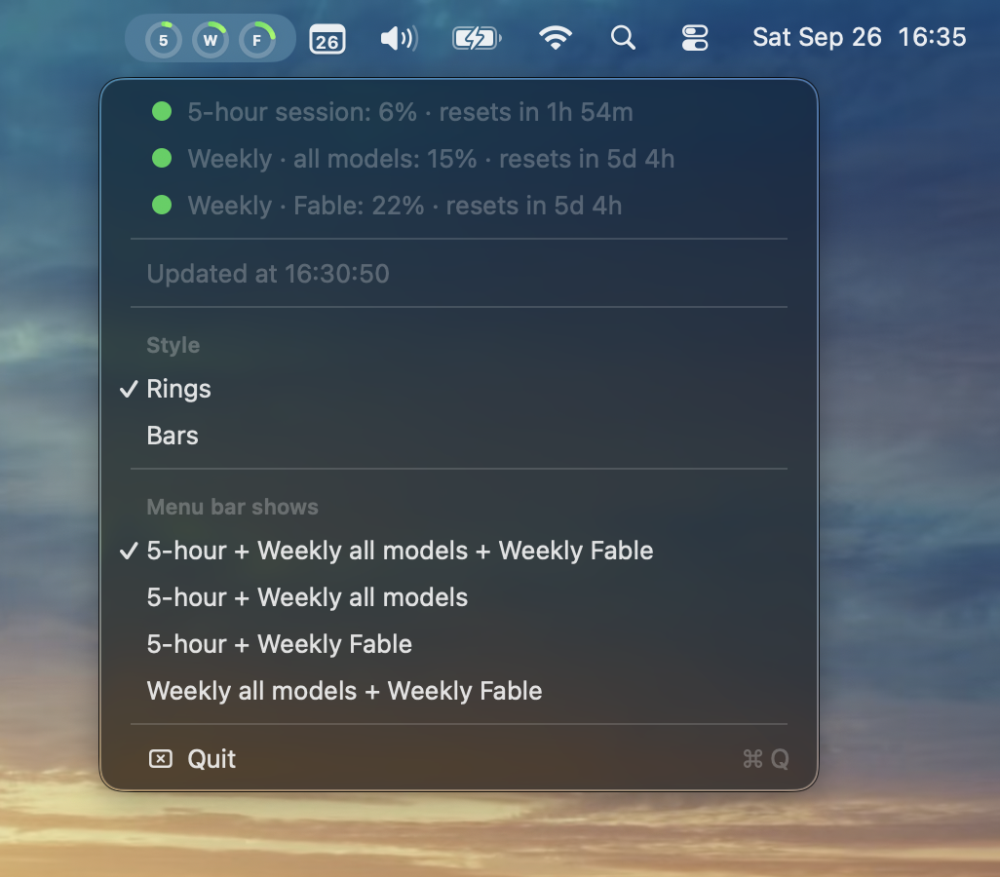

# Claude Usage

A tiny macOS menu bar app that shows how much of your Claude plan you have used:
one ring per limit (5-hour session, weekly, weekly Fable), and a menu with every
usage window and the time left before each reset.



Prefer bars? Switch the style in the menu:


Colors follow your usage: green to neon green below 60 %, orange to yellow from
60 to 85 %, red to pink above 85 %.

## Requirements

- macOS 13 or later, Apple silicon or Intel
- A Claude Pro or Max subscription, logged in with [Claude Code](https://claude.com/claude-code)

No API key is needed, and none is stored in this repository: the app reuses your
own Claude Code login from the macOS Keychain.

## Installation

1. Download **ClaudeUsage-x.y.zip** from the
   [latest release](https://github.com/lmaix/claude-usage/releases/latest).
2. Unzip it and drag **ClaudeUsage.app** to your **Applications** folder.
3. Open it. The app is signed and notarized by Apple, so it opens without any
   warning. It starts at login automatically.

### Build from source

Requires Xcode or the Xcode Command Line Tools (`xcode-select --install`).

```bash
git clone https://github.com/lmaix/claude-usage.git
cd claude-usage
./build.sh
```

`build.sh` runs the tests, compiles `ClaudeUsage.app`, installs it in
`~/Applications` and launches it. `./release.sh <version>` builds the signed,
notarized universal zip published in the releases.

## First launch

If you are already logged in to Claude Code, there is nothing to do: the app
shows your usage right away, with no Keychain password prompt.

Otherwise the icon shows **C!**. Click it, then **Sign in with Terminal…**: it
opens Terminal and runs `claude auth login`. The icon turns to a gray **C…**
while it waits, and your usage appears within a second of logging in.

`claude setup-token` does not work: that token only carries the
`user:inference` scope, and the usage endpoint requires `user:profile`.

## Settings

Everything is in the menu that opens when you click the icon.

### Style

- **Rings** (default): one ring per limit — **5** for the 5-hour session, **W**
  for weekly all models, **F** for weekly Fable. Exact percentages stay in the
  menu and the tooltip.
- **Bars**: two stacked bars with their percentage.


### Menu bar shows

Pick which limits appear in the menu bar. With **Rings**:

| Choice | Rings |
| --- | --- |
| 5-hour + Weekly all models + Weekly Fable (default) | 5 · W · F |
| 5-hour + Weekly all models | 5 · W |
| 5-hour + Weekly Fable | 5 · F |
| Weekly all models + Weekly Fable | W · F |

With **Bars**, top then bottom:

| Choice | Top bar | Bottom bar |
| --- | --- | --- |
| 5-hour + Weekly all models | 5-hour session | Weekly, all models |
| 5-hour + Weekly Fable (default) | 5-hour session | Weekly, Fable |
| Weekly all models + Weekly Fable | Weekly, all models | Weekly, Fable |

Each style remembers its own choice, applied immediately. If your plan has no
Fable weekly limit, the F ring is left out, and the Bars style shows another
available limit in its place.

### Launch at login

Enabled automatically on first launch. To turn it off: **System Settings →
General → Login Items**.

## How it works

- Source: `GET https://api.anthropic.com/api/oauth/usage`, the endpoint Claude
  Code itself uses. It is undocumented and may change.
- Polled every 10 minutes and when the Mac wakes up. On HTTP 429 the app honors
  `Retry-After`, otherwise backs off 5, 10, 20… up to 30 minutes.
- The last result is cached, so a restart shows your bars right away.
- The app reads Claude Code's login once and keeps its own copy in the Keychain
  (service `ClaudeUsage`); it never modifies Claude Code's item. All Keychain
  access goes through `/usr/bin/security`, the tool Claude Code itself uses,
  which is why there is no password prompt.
- When the session is about to expire (or on 401) the app renews it with the
  OAuth refresh token and updates its own copy.
- Nothing is sent anywhere except to Anthropic.
- Log: `~/Library/Logs/ClaudeUsage.log`.

## Uninstall

```bash
pkill -x ClaudeUsage
rm -rf /Applications/ClaudeUsage.app ~/Applications/ClaudeUsage.app
security delete-generic-password -s ClaudeUsage
rm -rf ~/Library/Application\ Support/ClaudeUsage ~/Library/Logs/ClaudeUsage.log
```

## Disclaimer

Unofficial project, not affiliated with Anthropic.

## License

[MIT](LICENSE)
