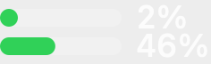

# ClaudeUsageBar

App macOS de barre de menus qui affiche l'usage du plan Claude : deux mini
barres (limite 5 h en haut, limite hebdo Fable en bas) avec leur pourcentage,
et un menu avec le détail de toutes les fenêtres, le temps avant reset et
l'usage extra.



## Installation

```bash
./build.sh
```

Compile, lance les tests, installe `~/Applications/ClaudeUsageBar.app`, la
démarre et l'inscrit au lancement à l'ouverture de session. Aucune dépendance
en dehors de Xcode.

## Connexion (une seule fois)

L'app utilise la session de Claude Code stockée dans le Trousseau macOS.
Si l'icône affiche « C! », ouvre le menu → « Se connecter dans le Terminal… »,
ou lance toi-même :

```bash
claude auth login
```

Au premier accès, macOS demande si ClaudeUsageBar peut lire l'élément
« Claude Code-credentials » du Trousseau : choisis **Toujours autoriser**.

Pourquoi pas `claude setup-token` ? Ce token ne porte que le scope
`user:inference`, alors que l'endpoint d'usage exige `user:profile` : il est
refusé (401). Seule la connexion complète fonctionne.

## Détails

- Source : `GET https://api.anthropic.com/api/oauth/usage`, toutes les 60 s et
  au réveil de la machine.
- Quand la session approche de son expiration (ou sur 401), l'app la renouvelle
  via le flux OAuth `refresh_token` de Claude Code et réécrit les nouveaux
  jetons dans l'élément Trousseau de Claude Code, pour que le CLI reste
  synchronisé.
- La 2e barre montre la fenêtre hebdo dont la clé contient « fable » ; à
  défaut, la fenêtre hebdo tous modèles.
- Couleurs : vert < 60 %, orange 60–85 %, rouge ≥ 85 %.
- Journal : `~/Library/Logs/ClaudeUsageBar.log` (erreurs HTTP, renouvellements).
