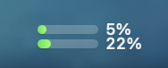

# ClaudeUsageBar

A tiny macOS menu bar app that shows how much of your Claude plan you have used:
two mini progress bars with their percentage, and a menu with every usage
window, the time left before each reset and your extra usage.




Bars go from green to neon green below 60 %, orange to yellow from 60 to 85 %,
and red to pink above 85 %:


## Requirements

- macOS 13 or later
- Xcode or the Xcode Command Line Tools (`xcode-select --install`), to compile
- A Claude Pro or Max subscription, logged in with [Claude Code](https://claude.com/claude-code)

No API key is needed, and none is stored in this repository: the app reuses your
own Claude Code login from the macOS Keychain.

## Installation

```bash
git clone https://github.com/lmaix/claude-usage.git
cd claude-usage
./build.sh
```

`build.sh` runs the tests, compiles `ClaudeUsageBar.app`, installs it in
`~/Applications`, launches it and registers it to start at login. No other
dependency.

## First launch

1. If you have never logged in to Claude Code, run:

   ```bash
   claude auth login
   ```

   The icon shows **C!** while the app is not connected; its menu also has a
   *Sign in with Terminal…* item that runs this command for you.
2. macOS asks whether ClaudeUsageBar may read the **Claude Code-credentials**
   Keychain item: choose **Always Allow**. This happens once: the app then keeps
   its own copy of the session in its own Keychain item and never modifies
   Claude Code's.

`claude setup-token` does not work: that token only carries the
`user:inference` scope, and the usage endpoint requires `user:profile`.

## Settings

Everything is in the menu that opens when you click the icon.

### Style

- **Bars** (default): two stacked bars with their percentage.
- **Rings**: one ring per limit — **5** for the 5-hour session, **W** for weekly
  all models, **F** for weekly Fable — so all three fit at once. Exact
  percentages stay in the menu and the tooltip.


### Displayed bars

With the Bars style, under **Menu bar shows**, pick which two limits appear in the menu bar, top then bottom:

| Choice | Top bar | Bottom bar |
| --- | --- | --- |
| 5-hour + Weekly Fable (default) | 5-hour session | Weekly, Fable |
| 5-hour + Weekly all models | 5-hour session | Weekly, all models |
| Weekly all models + Weekly Fable | Weekly, all models | Weekly, Fable |

The choice is saved and applied immediately. If your plan has no Fable weekly
limit, the app shows another available limit in its place.

### Launch at login

Enabled automatically by `build.sh`. To turn it off: **System Settings →
General → Login Items**.

## How it works

- Source: `GET https://api.anthropic.com/api/oauth/usage`, the endpoint Claude
  Code itself uses. It is undocumented and may change.
- Polled every 10 minutes and when the Mac wakes up. On HTTP 429 the app honors
  `Retry-After`, otherwise backs off 5, 10, 20… up to 30 minutes.
- The last result is cached, so a restart shows your bars right away.
- When the session is about to expire (or on 401) the app renews it with the
  OAuth refresh token and stores the new tokens in its own Keychain item
  (service `ClaudeUsageBar`).
- Nothing is sent anywhere except to Anthropic.
- Log: `~/Library/Logs/ClaudeUsageBar.log`.

## Uninstall

```bash
pkill -x ClaudeUsageBar
rm -rf ~/Applications/ClaudeUsageBar.app
security delete-generic-password -s ClaudeUsageBar
rm -rf ~/Library/Application\ Support/ClaudeUsageBar ~/Library/Logs/ClaudeUsageBar.log
```

## Disclaimer

Unofficial project, not affiliated with Anthropic.

## License

[MIT](LICENSE)
